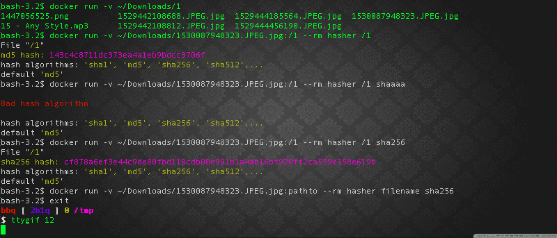

# hasher

simple file hasher using node.js crypto

### Usage

```sh
$ node hasher.js <file_name> <hash_type>
$ node hasher.js my_file sha256
```

if <hash_type> not passed => <hash_type> = md5

### Use docker container

- Pull IMG, Run hasher and remove container

```sh
docker run --rm -v ~/Downloads/20150922120001.mp4:/file 2b1q/hasher /file 'sha256'
```

### Use docker container

1. git clone

```sh
$ git clone https://github.com/2b1q/hasher.git
```

2. [install docker](https://docs.docker.com/install/)
3. build docker container

```sh
$ docker build -t hasher .
```

3. run hasher container. pass file & args

```sh
$ docker run -v ~/Downloads/myFile.png:/1 --rm hasher /1 sha256
```

### Demo 1 (not containerized app)


### Demo 2 (docker containerized app)


